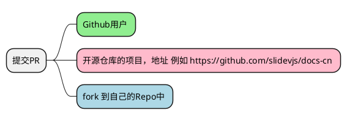
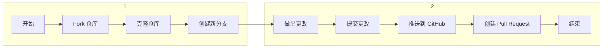

## 前提

```plantuml
@startmindmap
<style>
mindmapDiagram {
  .green {
    BackgroundColor lightgreen
  }
  .rose {
    BackgroundColor #FFBBCC
  }
  .your_style_name {
    BackgroundColor lightblue
  }
}
</style>
* 提交PR
** Github用户 <<green>>
** 开源仓库的项目，地址 例如 https://github.com/slidevjs/docs-cn <<rose>>
** fork 到自己的Repo中 <<your_style_name>>
@endmindmap
```

---

## 流程

```mermaid {theme: 'neutral', scale: 0.5}
graph LR;
    subgraph 1
        A[开始] --> B[Fork 仓库]
        B --> C[克隆仓库]
        C --> D[创建新分支]
    end

    subgraph 2
        D --> E[做出更改]
        E --> F[提交更改]
        F --> G[推送到 GitHub]
        G --> H[创建 Pull Request]
        H --> I[结束]
    end
```
