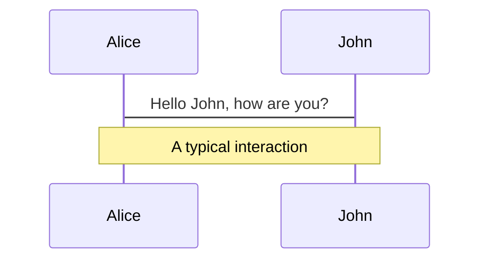
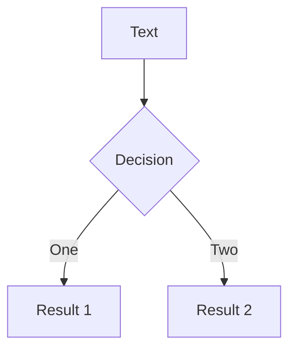

```mermaid
sequenceDiagram
  Alice->John: Hello John, how are you?
  Note over Alice,John: A typical interaction
```
---

```mermaid {theme: 'neutral', scale: 0.8}
graph TD
B[Text] --> C{Decision}
C -->|One| D[Result 1]
C -->|Two| E[Result 2]
```
